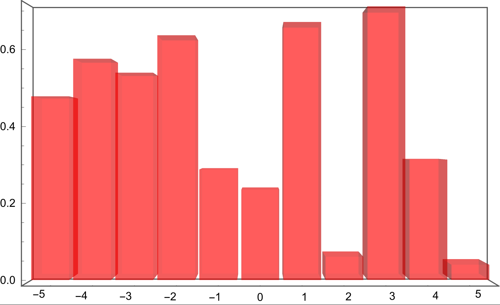
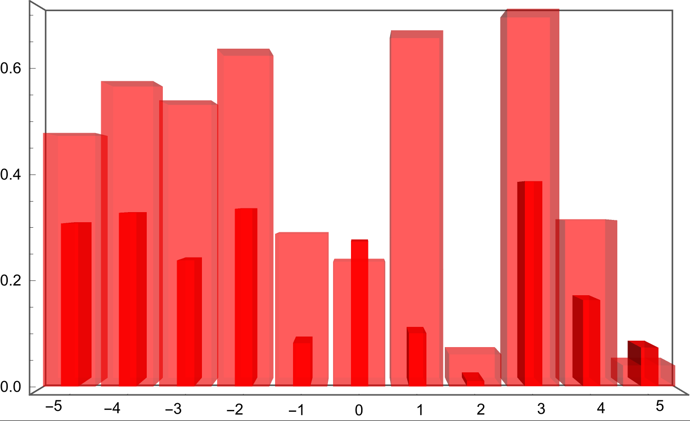

```wl
In[]:= TestData = Table[{ii, RandomReal[]}, {ii, -5, 5}];
 TestData2 = Table[{ii, 0.4 RandomReal[]}, {ii, -5, 5}];
```

```wl
In[]:= BarChartSingleLine3D[TestData, 0.9, Red, 0.4]
```



```wl
In[]:= Show[BarChartSingleLine3D[TestData, 0.9, Red, 0.4], BarChartSingleLine3D[TestData2, 0.3, Red, 0.8]]
```



```wl
In[]:= 
```

```wl
In[]:= BarChartSingleLine3D[Data_, thick_ : 0.9, Col_ : Blue, Opa_ : 1] := Module[
     {Bar, BarPlot, FinalPlot, ticks}, 
     
     ticks = ({#, ToString[#]}) & /@ Data[[All, 1]]; 
     
    (*Simple 3D Bar in a single line *) 
     Bar[data_, thickness_ : 0.95] := Cuboid[{0, 0, 0} + {data[[1]] - thickness/2, 0, 0}, {thickness/2, 0.5, 0} + {data[[1]], 0, data[[2]]}]; 
     
    (*Bar Plot*) 
     BarPlot = Graphics3D[{Opacity[Opa], EdgeForm[], Col, Bar[#, thick]} & /@ Data, 
       Boxed -> {Front, Top, Bottom}, 
       BoxStyle -> {Thick, Darker@Gray}, 
       AspectRatio -> 0.6, 
       BoxRatios -> {1, 0.1, 0.7}, 
       Lighting -> "Neutral" 
       ]; 
     
     Return[Show[
       BarPlot, 
       LightingAngle -> 90 Degree, 
       Axes -> True, 
       Ticks -> {ticks, {}, Automatic},(*x-ticks only,no y-ticks*)
       TicksStyle -> Directive[Black, 20], 
       ViewProjection -> "Orthographic"; 
       ViewPoint -> Front, 
       ImageSize -> 900]] 
    ] 
  
 
```